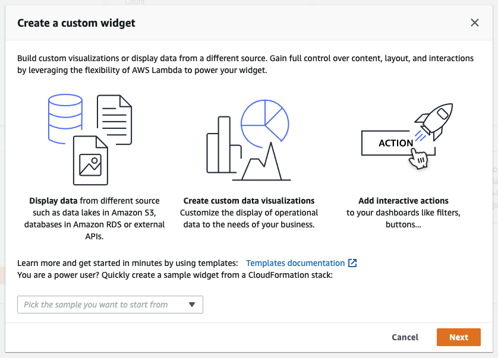
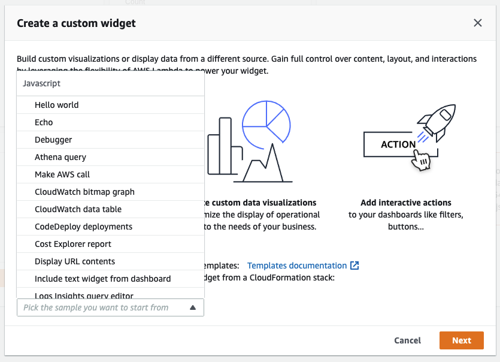

# CloudWatch Custom Widgets Samples

[](LICENSE)
[](https://docs.aws.amazon.com/AmazonCloudWatch/latest/monitoring/WhatIsCloudWatch.html)

The samples in this project demonstrate several uses of Custom Widgets within a CloudWatch Dashboard.

<h2 id="table-of-contents">Table of Contents</h2>

<details open="open">
  <summary>Table of Contents</summary>
  <ol>
    <li><a href="#what-are-custom-widgets"> ➤ What are Custom Widgets?</a></li>
    <li><a href="#why-would-i-use-custom-widgets"> ➤ Why would I use Custom Widgets?</a></li>
    <li>
      <a href="#sounds-great-how-do-i-sign-up"> ➤ Sounds great, how do I sign up?</a>
      <ul>
        <li><a href="#option-a-using-the-cloudwatch-console">Option A: Using the CloudWatch Console</a></li>
        <li><a href="#option-b-using-this-repository-directly">Option B: Using this repository directly</a></li>
        <li><a href="#option-c-manually-from-a-cloudwatch-dashboard">Option C: Manually from a CloudWatch Dashboard</a></li>
      </ul>
    </li>
    <li>
      <a href="#even-quicker-2-click-samples"> ➤ Even quicker - 2-click samples</a>
      <ul>
        <li><a href="#javascript-samples">JavaScript samples</a></li>
        <li><a href="#python-samples">Python samples</a></li>
      </ul>
    </li>
    <li><a href="#how-does-a-widget-work"> ➤ How does a widget work?</a></li>
    <li><a href="#can-the-returned-html-contain-any-html-tags"> ➤ Can the returned HTML contain any HTML tags?</a></li>
    <li><a href="#is-interactivity-possible-in-the-returned-html"> ➤ Is interactivity possible in the returned HTML?</a></li>
    <li>
      <a href="#what-can-i-do-with-the-cwdb-action-tag"> ➤ What can I do with the cwdb-action tag?</a>
      <ul>
        <li><a href="#cwdb-action-definition-and-usage">cwdb-action: Definition and usage</a></li>
        <li><a href="#cwdb-action-examples">cwdb-action: Examples</a></li>
      </ul>
    </li>
    <li><a href="#can-i-call-custom-widget-functions-in-other-accounts"> ➤ Can I call Custom Widget functions in other accounts?</a></li>
    <li><a href="#can-a-lambda-function-call-a-customers-internal-services"> ➤ Can a Lambda function call a customer's internal services?</a></li>
    <li><a href="#can-access-to-custom-widgets-be-restricted"> ➤ Can access to Custom Widgets be restricted?</a></li>
    <li><a href="#what-is-the-hello-world-custom-widget-example"> ➤ What is the 'Hello world' Custom Widget example?</a></li>
    <li><a href="#example-of-returning-data-from-a-call-to-an-aws-function"> ➤ Example of returning data from a call to an AWS function?</a></li>
    <li><a href="#can-the-user-of-a-custom-widget-customize-its-behavior"> ➤ Can the user of a Custom Widget customize its behavior?</a></li>
    <li><a href="#does-custom-widgets-refresh-and-auto-refresh"> ➤ Does Custom Widgets refresh and auto-refresh?</a></li>
    <li><a href="#can-custom-widgets-be-resized-and-moved-around-the-dashboard"> ➤ Can Custom Widgets be resized and moved around the dashboard?</a></li>
    <li><a href="#can-custom-widgets-react-to-the-time-range-of-the-dashboard"> ➤ Can Custom Widgets react to the time range of the dashboard?</a></li>
    <li><a href="#is-lambda-the-only-api-that-these-widgets-can-call"> ➤ Is Lambda the only API that these widgets can call?</a></li>
    <li><a href="#what-is-the-default-style-of-custom-widget-html-elements"> ➤ What is the default style of Custom Widget HTML elements?</a></li>
    <li><a href="#can-i-customize-the-style-of-the-html-elements"> ➤ Can I customize the style of the HTML elements?</a></li>
    <li><a href="#can-the-default-styles-be-disabled"> ➤ Can the default styles be disabled?</a></li>
    <li><a href="#can-i-use-custom-widgets-in-my-own-website"> ➤ Can I use Custom Widgets in my own website?</a></li>
    <li><a href="#contributing"> ➤ Contributing</a></li>
    <li><a href="#license"> ➤ License</a></li>
  </ol>
</details>

<h2 id="what-are-custom-widgets">What are Custom Widgets?</h2>

A **Custom Widget** is a [CloudWatch Dashboards](https://aws.amazon.com/blogs/aws/cloudwatch-dashboards-create-use-customized-metrics-views/) widget that can display virtually anything you want. Custom Widgets enables you to add custom visualizations, display information from multiple sources or add custom controls like buttons to take actions directly in a CloudWatch Dashboard. Custom Widgets are powered by custom Lambda functions, enabling complete control over the content, layout, and interactions. You can add custom widgets programmatically using the AWS SDK, CLI and CloudFormation.

<h2 id="why-would-i-use-custom-widgets">Why would I use Custom Widgets?</h2>

Custom Widgets is a simple way to build a custom data view or tool on a dashboard. There's no complicated web framework to learn, it's completely serverless. If you can write code in Lambda and create HTML then you can create a useful custom widget.

<h2 id="sounds-great-how-do-i-sign-up">Sounds great, how do I sign up?</h2>

<h3 id="option-a-using-the-cloudwatch-console">Option A: Using the CloudWatch Console</h3>

The samples are already available in the CloudWatch Console, from a CloudWatch dashboard you can click the **Add widget** button and then select **Custom widget**. The samples found within this repository are available for a 1-click quick creation:

<div align="center">

  

  

</div>

<h3 id="option-b-using-this-repository-directly">Option B: Using this repository directly</h3>

1. Clone the repo
2. Run the build script: `scripts/build-assets`
3. YAML templates will be generated inside the `build` folder e.g.:
```
build
└── cfn
    ├── customWidgetSample1-js.yaml
    ├── customWidgetSample2-py.yaml
    ├── customWidgetSample3-js.yaml
    ├── customWidgetSample4-py.yaml
    ├── ...
    └── customWidgetSampleN-py.yaml
```
4. The templates can be deployed with the [AWS CloudFormation](https://docs.aws.amazon.com/AWSCloudFormation/latest/UserGuide/Welcome.html) web console (or the [AWS CLI](https://docs.aws.amazon.com/cli/latest/userguide/cli-chap-welcome.html))
5. Modify them or adjust them to suit your own use case and needs!

<h3 id="option-c-manually-from-a-cloudwatch-dashboard">Option C: Manually from a CloudWatch Dashboard</h3>

Alternatively, add this entry into the **widgets** array of any CloudWatch Dashboard - go to **Actions -&gt; View/edit source:**

``` json
{
    "type": "custom"
}
```

<h2 id="even-quicker-2-click-samples">Even quicker - 2-click samples</h2>

The following links launch a sample Custom Widget into your AWS account, along with a sample dashboard showing how the widget works. To launch:
* if you're not happy with default region of **us-east-1 (N. Virginia)** switch region at top right of AWS Console
* change the function name if you want to use it as a starter widget of your own
* tick the **I acknowledge that AWS CloudFormation might create IAM resources.** checkbox
* click orange **Create stack** button

CloudFormation will create the custom widget Lambda function and sample CloudWatch Dashboard that uses it for you within a minute. Once the stack is created check the **Outputs** tab for links to the Lambda function code and sample dashboard. Edit the widget code directly in Lambda console and test changes directly in CloudWatch dashboard.

<h3 id="javascript-samples">JavaScript samples</h3>

* [Hello world](https://console.aws.amazon.com/cloudformation/home?region=us-east-1#/stacks/quickCreate?stackName=customWidgetHelloWorld-js&templateURL=https%3A%2F%2Fcloudwatch-console-static-content-prod-iad.s3.us-east-1.amazonaws.com%2F9753ba04bff2b1ff86e02c81255e652d89a3920e%2FcustomWidgets%2FcustomWidgetHelloWorld-js.yaml&param_DoCreateExampleDashboard=Yes): a very simple starter widget
* [Custom widget debugger](https://console.aws.amazon.com/cloudformation/home?region=us-east-1#/stacks/quickCreate?stackName=customWidgetDebugger-js&templateURL=https%3A%2F%2Fcloudwatch-console-static-content-prod-iad.s3.us-east-1.amazonaws.com%2F9753ba04bff2b1ff86e02c81255e652d89a3920e%2FcustomWidgets%2FcustomWidgetDebugger-js.yaml&param_DoCreateExampleDashboard=Yes): a helpful debugger widget that displays useful information about the Lambda runtime environment
* [Echo](https://console.aws.amazon.com/cloudformation/home?region=us-east-1#/stacks/quickCreate?stackName=customWidgetEcho-js&templateURL=https%3A%2F%2Fcloudwatch-console-static-content-prod-iad.s3.us-east-1.amazonaws.com%2F3dbc23e3f05991cbf9e942f6a7872273391faece%2FcustomWidgets%2FcustomWidgetEcho-js.yaml&param_DoCreateExampleDashboard=Yes): a simple echoer. Test how HTML will appear in a widget without writing a widget
* [Run Athena queries](https://console.aws.amazon.com/cloudformation/home?region=us-east-1#/stacks/quickCreate?stackName=customWidgetAthenaQuery-js&templateURL=https%3A%2F%2Fcloudwatch-console-static-content-prod-iad.s3.us-east-1.amazonaws.com%2F9753ba04bff2b1ff86e02c81255e652d89a3920e%2FcustomWidgets%2FcustomWidgetAthenaQuery-js.yaml&param_DoCreateExampleDashboard=Yes): run and edit queries against [Amazon Athena](https://aws.amazon.com/athena/)
* [Call AWS API](https://console.aws.amazon.com/cloudformation/home?region=us-east-1#/stacks/quickCreate?stackName=customWidgetAwsCall-js&templateURL=https%3A%2F%2Fcloudwatch-console-static-content-prod-iad.s3.us-east-1.amazonaws.com%2F9753ba04bff2b1ff86e02c81255e652d89a3920e%2FcustomWidgets%2FcustomWidgetAwsCall-js.yaml&param_DoCreateExampleDashboard=Yes): call any read-only AWS API and display results as JSON
* [EC2 Table](https://console.aws.amazon.com/cloudformation/home?region=us-east-1#/stacks/quickCreate?stackName=customWidgetEc2Table-js&templateURL=https%3A%2F%2Fcloudwatch-console-static-content-prod-iad.s3.us-east-1.amazonaws.com%2F3dbc23e3f05991cbf9e942f6a7872273391faece%2FcustomWidgets%2FcustomWidgetEc2Table-js.yaml&param_DoCreateExampleDashboard=Yes): display top EC2 instances by CPU, plus a Reboot button (disabled by default as IAM role created only has read-only permissions needed to read EC2 instances and metric data)
* [Fast CloudWatch bitmap graphs](https://console.aws.amazon.com/cloudformation/home?region=us-east-1#/stacks/quickCreate?stackName=customWidgetCloudWatchBitmapGraph-js&templateURL=https%3A%2F%2Fcloudwatch-console-static-content-prod-iad.s3.us-east-1.amazonaws.com%2F9753ba04bff2b1ff86e02c81255e652d89a3920e%2FcustomWidgets%2FcustomWidgetCloudWatchBitmapGraph-js.yaml&param_DoCreateExampleDashboard=Yes): render CloudWatch graphs server-side, for faster display
* [CloudWatch metric data as table](https://console.aws.amazon.com/cloudformation/home?region=us-east-1#/stacks/quickCreate?stackName=customWidgetCloudWatchMetricDataTable-js&templateURL=https%3A%2F%2Fcloudwatch-console-static-content-prod-iad.s3.us-east-1.amazonaws.com%2F9753ba04bff2b1ff86e02c81255e652d89a3920e%2FcustomWidgets%2FcustomWidgetCloudWatchMetricDataTable-js.yaml&param_DoCreateExampleDashboard=Yes): display raw CloudWatch metric data in table
* [Code Deployments](https://console.aws.amazon.com/cloudformation/home?region=us-east-1#/stacks/quickCreate?stackName=customWidgetCodeDeploy-js&templateURL=https%3A%2F%2Fcloudwatch-console-static-content-prod-iad.s3.us-east-1.amazonaws.com%2F9753ba04bff2b1ff86e02c81255e652d89a3920e%2FcustomWidgets%2FcustomWidgetCodeDeploy-js.yaml&param_DoCreateExampleDashboard=Yes): display [CodeDeploy](https://aws.amazon.com/codedeploy/) deployments
* [Cost explorer report](https://console.aws.amazon.com/cloudformation/home?region=us-east-1#/stacks/quickCreate?stackName=customWidgetCostExplorerReport-js&templateURL=https%3A%2F%2Fcloudwatch-console-static-content-prod-iad.s3.us-east-1.amazonaws.com%2F9753ba04bff2b1ff86e02c81255e652d89a3920e%2FcustomWidgets%2FcustomWidgetCostExplorerReport-js.yaml&param_DoCreateExampleDashboard=Yes): displays a report on cost of each AWS service for a selected time range
* [Display content of external URL](https://console.aws.amazon.com/cloudformation/home?region=us-east-1#/stacks/quickCreate?stackName=customWidgetFetchURL-js&templateURL=https%3A%2F%2Fcloudwatch-console-static-content-prod-iad.s3.us-east-1.amazonaws.com%2F9753ba04bff2b1ff86e02c81255e652d89a3920e%2FcustomWidgets%2FcustomWidgetFetchURL-js.yaml&param_DoCreateExampleDashboard=Yes): display externally accessible HTML content
* [Include text widget from dashboard](https://console.aws.amazon.com/cloudformation/home?region=us-east-1#/stacks/quickCreate?stackName=customWidgetIncludeTextWidget-js&templateURL=https%3A%2F%2Fcloudwatch-console-static-content-prod-iad.s3.us-east-1.amazonaws.com%2F9753ba04bff2b1ff86e02c81255e652d89a3920e%2FcustomWidgets%2FcustomWidgetIncludeTextWidget-js.yaml&param_DoCreateExampleDashboard=Yes): displays the first text widget from a specified CloudWatch Dashboard
* [Run Logs Insights queries](https://console.aws.amazon.com/cloudformation/home?region=us-east-1#/stacks/quickCreate?stackName=customWidgetLogsInsightsQuery-js&templateURL=https%3A%2F%2Fcloudwatch-console-static-content-prod-iad.s3.us-east-1.amazonaws.com%2F9753ba04bff2b1ff86e02c81255e652d89a3920e%2FcustomWidgets%2FcustomWidgetLogsInsightsQuery-js.yaml&param_DoCreateExampleDashboard=Yes): run and edit queries against [CloudWatch Logs Insights](https://docs.aws.amazon.com/AmazonCloudWatch/latest/logs/AnalyzingLogData.html)
* [Display S3 object](https://console.aws.amazon.com/cloudformation/home?region=us-east-1#/stacks/quickCreate?stackName=customWidgetS3GetObject-js&templateURL=https%3A%2F%2Fcloudwatch-console-static-content-prod-iad.s3.us-east-1.amazonaws.com%2F9753ba04bff2b1ff86e02c81255e652d89a3920e%2FcustomWidgets%2FcustomWidgetS3GetObject-js.yaml&param_DoCreateExampleDashboard=Yes): display object from S3 bucket in your account
* [Simple SVG pie chart](https://console.aws.amazon.com/cloudformation/home?region=us-east-1#/stacks/quickCreate?stackName=customWidgetSimplePie-js&templateURL=https%3A%2F%2Fcloudwatch-console-static-content-prod-iad.s3.us-east-1.amazonaws.com%2F9753ba04bff2b1ff86e02c81255e652d89a3920e%2FcustomWidgets%2FcustomWidgetSimplePie-js.yaml&param_DoCreateExampleDashboard=Yes): simple example of graphical SVG-based widget

<h3 id="python-samples">Python samples</h3>

* [Hello world](https://console.aws.amazon.com/cloudformation/home?region=us-east-1#/stacks/quickCreate?stackName=customWidgetHelloWorld-py&templateURL=https%3A%2F%2Fcloudwatch-console-static-content-prod-iad.s3.us-east-1.amazonaws.com%2F9753ba04bff2b1ff86e02c81255e652d89a3920e%2FcustomWidgets%2FcustomWidgetHelloWorld-py.yaml&param_DoCreateExampleDashboard=Yes): a very simple starter widget
* [Custom widget debugger](https://console.aws.amazon.com/cloudformation/home?region=us-east-1#/stacks/quickCreate?stackName=customWidgetDebugger-py&templateURL=https%3A%2F%2Fcloudwatch-console-static-content-prod-iad.s3.us-east-1.amazonaws.com%2F9753ba04bff2b1ff86e02c81255e652d89a3920e%2FcustomWidgets%2FcustomWidgetDebugger-py.yaml&param_DoCreateExampleDashboard=Yes): a helpful debugger widget that displays useful information about the Lambda runtime environment
* [Echo](https://console.aws.amazon.com/cloudformation/home?region=us-east-1#/stacks/quickCreate?stackName=customWidgetEcho-py&templateURL=https%3A%2F%2Fcloudwatch-console-static-content-prod-iad.s3.us-east-1.amazonaws.com%2F3dbc23e3f05991cbf9e942f6a7872273391faece%2FcustomWidgets%2FcustomWidgetEcho-py.yaml&param_DoCreateExampleDashboard=Yes): a simple echoer. Test how HTML will appear in a widget without writing a widget
* [Call AWS API](https://console.aws.amazon.com/cloudformation/home?region=us-east-1#/stacks/quickCreate?stackName=customWidgetAwsCall-py&templateURL=https%3A%2F%2Fcloudwatch-console-static-content-prod-iad.s3.us-east-1.amazonaws.com%2F9753ba04bff2b1ff86e02c81255e652d89a3920e%2FcustomWidgets%2FcustomWidgetAwsCall-py.yaml&param_DoCreateExampleDashboard=Yes): call any read-only AWS API and display results as JSON
* [Fast CloudWatch bitmap graphs](https://console.aws.amazon.com/cloudformation/home?region=us-east-1#/stacks/quickCreate?stackName=customWidgetCloudWatchBitmapGraph-py&templateURL=https%3A%2F%2Fcloudwatch-console-static-content-prod-iad.s3.us-east-1.amazonaws.com%2F9753ba04bff2b1ff86e02c81255e652d89a3920e%2FcustomWidgets%2FcustomWidgetCloudWatchBitmapGraph-py.yaml&param_DoCreateExampleDashboard=Yes): render CloudWatch graphs server-side, for faster display
* [Send dashboard snapshot by email](https://console.aws.amazon.com/cloudformation/home?region=us-east-1#/stacks/quickCreate?stackName=customWidgetEmailDashboardSnapshot-py&templateURL=https%3A%2F%2Fcloudwatch-console-static-content-prod-iad.s3.us-east-1.amazonaws.com%2F9753ba04bff2b1ff86e02c81255e652d89a3920e%2FcustomWidgets%2FcustomWidgetEmailDashboardSnapshot-py.yaml&param_DoCreateExampleDashboard=Yes): take a snapshot of the current dashboard and send it to email recipient
* [Display content of an external URL](https://console.aws.amazon.com/cloudformation/home?region=us-east-1#/stacks/quickCreate?stackName=customWidgetFetchURL-py&templateURL=https%3A%2F%2Fcloudwatch-console-static-content-prod-iad.s3.us-east-1.amazonaws.com%2F9753ba04bff2b1ff86e02c81255e652d89a3920e%2FcustomWidgets%2FcustomWidgetFetchURL-py.yaml&param_DoCreateExampleDashboard=Yes): display externally accessible HTML content
* [Include text widget from dashboard](https://console.aws.amazon.com/cloudformation/home?region=us-east-1#/stacks/quickCreate?stackName=customWidgetIncludeTextWidget-py&templateURL=https%3A%2F%2Fcloudwatch-console-static-content-prod-iad.s3.us-east-1.amazonaws.com%2F9753ba04bff2b1ff86e02c81255e652d89a3920e%2FcustomWidgets%2FcustomWidgetIncludeTextWidget-py.yaml&param_DoCreateExampleDashboard=Yes): displays the first text widget from a specified CloudWatch Dashboard
* [RSS Reader](https://console.aws.amazon.com/cloudformation/home?region=us-east-1#/stacks/quickCreate?stackName=customWidgetRssReader-py&templateURL=https%3A%2F%2Fcloudwatch-console-static-content-prod-iad.s3.us-east-1.amazonaws.com%2F9753ba04bff2b1ff86e02c81255e652d89a3920e%2FcustomWidgets%2FcustomWidgetRssReader-py.yaml&param_DoCreateExampleDashboard=Yes): display RSS feeds
* [Display S3 object](https://console.aws.amazon.com/cloudformation/home?region=us-east-1#/stacks/quickCreate?stackName=customWidgetS3GetObject-py&templateURL=https%3A%2F%2Fcloudwatch-console-static-content-prod-iad.s3.us-east-1.amazonaws.com%2F9753ba04bff2b1ff86e02c81255e652d89a3920e%2FcustomWidgets%2FcustomWidgetS3GetObject-py.yaml&param_DoCreateExampleDashboard=Yes): display object from S3 bucket in your account
* [Simple SVG pie chart](https://console.aws.amazon.com/cloudformation/home?region=us-east-1#/stacks/quickCreate?stackName=customWidgetSimplePie-py&templateURL=https%3A%2F%2Fcloudwatch-console-static-content-prod-iad.s3.us-east-1.amazonaws.com%2F9753ba04bff2b1ff86e02c81255e652d89a3920e%2FcustomWidgets%2FcustomWidgetSimplePie-py.yaml&param_DoCreateExampleDashboard=Yes): simple example of graphical SVG-based widget
* [Snapshot dashboard to S3](https://console.aws.amazon.com/cloudformation/home?region=us-east-1#/stacks/quickCreate?stackName=customWidgetSnapshotDashboardToS3-py&templateURL=https%3A%2F%2Fcloudwatch-console-static-content-prod-iad.s3.us-east-1.amazonaws.com%2F9753ba04bff2b1ff86e02c81255e652d89a3920e%2FcustomWidgets%2FcustomWidgetSnapshotDashboardToS3-py.yaml&param_DoCreateExampleDashboard=Yes): take a snapshot of the current dashboard and store it in S3

<h2 id="how-does-a-widget-work">How does a widget work?</h2>

Your CloudWatch Dashboard:
1. calls the Lambda function containing the widget code. The function is passed any custom parameters defined in the widget
2. the Lambda function is expected to return a string of HTML
3. the CloudWatch Dashboard displays the HTML
4. if the response is JSON it is displayed as formatted JSON

<h2 id="can-the-returned-html-contain-any-html-tags">Can the returned HTML contain any HTML tags?</h2>

Almost all HTML tags are supported. CSS styles and SVGs can be used for building sophisticated and graphically rich views.

However, for security reasons _JavaScript_ is not allowed in the returned HTML. If the HTML string from the Lambda function contains any Javascript it will be "cleaned" from the HTML before rendering. Also, the **&lt;iframe&gt;** tag is forbidden.

Removing Javascript is done to prevent privilege escalation issues, where the writer of the Lambda function can inject code that would run with the possibly higher privileges of the user viewing the widget in the CloudWatch Console.

<h2 id="is-interactivity-possible-in-the-returned-html">Is interactivity possible in the returned HTML?</h2>

Yes. Even though JavaScript is not allowed, there are a number of avenues that allow interactivity with the returned HTML:

* Any element in the returned HTML can be tagged with special configuration in a **&lt;cwdb-action&gt;** tag that trigger display information in popups, ask for confirmation on clicks can call any Lambda function when that element is clicked. This allows for example the definition of buttons that will call any AWS API via a Lambda function. The returned HTML can be set to either replace the existing Lambda widget&#39;s content, or display inside a modal.
* HTML can include links that open new consoles, other customer pages or load other dashboards
* HTML can include the &#39;title&#39; attribute for an element, that gives additional information if the user hovers over that element
* HTML can include CSS selectors such as :hover which can trigger animations or different CSS effects

<h2 id="what-can-i-do-with-the-cwdb-action-tag">What can I do with the cwdb-action tag?</h2>

Example of how to create a button that reboots an EC2 instance via a Lambda function call, displaying the success or failure of the call in a popup:

``` html
<a class="btn">Reboot Instance</a>
<cwdb-action action="call" endpoint="arn:aws:lambda:us-east-1:123456:function:rebootInstance" display="popup">  
     { "instanceId": "i-342389adbfef" }
</cwdb-action> 
```

<h3 id="cwdb-action-definition-and-usage">cwdb-action: Definition and usage</h3>

The **&lt;cwdb-action&gt;** element defines a behavior on the previous element. The content of the **&lt;cwdb-action&gt;** is either HTML to display or JSON of parameters to pass to the call to a Lambda function.

**Attributes**
General definition:
``` html
<cwdb-action 
     action="call|html" 
     confirmation="message" 
     display="popup|widget" 
     endpoint="<lambda ARN>" 
     event="click|dblclick|mouseenter">  

    html | params in JSON  

</cwdb-action> 
```

| Attribute | Value | Description |
| --- | --- | --- |
| **action** | call &#124; html | Two actions are supported, _call_ a Lambda function or (default) display _html_ contained within **&lt;cwdb-action&gt;** |
| **confirmation** | _message_ | Displays a confirmation message that needs to be acknowledged before the action is taken (allowing customer to cancel) |
| **display** | popup &#124; widget | Where should action result be displayed. Can be either in a _popup_ or (default) replace the content of the _widget_ itself |
| **endpoint** | _arn of lambda function_ | The ARN of the Lambda function to call. Required if **action** is set to **call** |
| **event** | click &#124; dblclick &#124; mouseenter | The event on the previous element which triggers the action, defaults to _click_ |

<h3 id="cwdb-action-examples">cwdb-action: Examples</h3>

A link which displays more information in a popup:
``` html
<a>Click me for more info in popup</a>
<cwdb-action display="popup">  
   <h1>Big title</h1>
   More info about <b>something important</b>.
</cwdb-action> 
```
A Next button (primary) which replaces content of widget with call to a Lambda:
``` html
<a class="btn btn-primary">Next</a>
<cwdb-action action="call" endpoint="arn:aws:lambda:us-east-1:123456:function:nextPage">  
   { "pageNum": 2 }
</cwdb-action> 
```

<h2 id="can-i-call-custom-widget-functions-in-other-accounts">Can I call Custom Widget functions in other accounts?</h2>

Yes. In order to help with sharing of functionality between multiple accounts owned by a customer, a Custom Widget function can be defined in one account and called from the dashboards of other accounts, as long as the correct permissions have been defined to allow access from other accounts. Follow [CloudWatch Cross-Account Cross-Region setup](https://docs.aws.amazon.com/AmazonCloudWatch/latest/monitoring/Cross-Account-Cross-Region.html) and make sure you allow the current account to invoke the custom widget Lambda function in the shared account(s).

The CloudWatch Dashboard facilitates this by allowing the customer to pick a Lambda function by pasting a raw ARN to it into the Dashboard definition.

<h2 id="can-a-lambda-function-call-a-customers-internal-services">Can a Lambda function call a customer's internal services?</h2>

If those services are accessible within an AWS VPC then the Lambda function can run within that VPC, thus allowing access to the customer's internal services/data.

<h2 id="can-access-to-custom-widgets-be-restricted">Can access to Custom Widgets be restricted?</h2>

Yes. Normal IAM policies can be applied so that IAM users can be allowlisted or blocklisted for Lambda execute permissions on all or particular Lambda functions.

This allows customers to share a single dashboard with multiple users but lock down the view of particular Lambda widgets to users with higher privileges.

<h2 id="what-is-the-hello-world-custom-widget-example">What is the 'Hello world' Custom Widget example?</h2>

Below is the Javascript code for the [Hello world](https://console.aws.amazon.com/cloudformation/home?region=us-east-1#/stacks/quickCreate?stackName=customWidgetHelloWorld-js&templateURL=https%3A%2F%2Fcloudwatch-console-static-content-prod-iad.s3.us-east-1.amazonaws.com%2F9753ba04bff2b1ff86e02c81255e652d89a3920e%2FcustomWidgets%2FcustomWidgetHelloWorld-js.yaml&param_DoCreateExampleDashboard=Yes) example:

``` javascript
exports.handler = async (event) => {
    const name = event.name || 'friend';
    return `<h1>Hello ${name}</h1>`;
};
```

And here is the Python version of [Hello world](https://console.aws.amazon.com/cloudformation/home?region=us-east-1#/stacks/quickCreate?stackName=customWidgetHelloWorld-py&templateURL=https%3A%2F%2Fcloudwatch-console-static-content-prod-iad.s3.us-east-1.amazonaws.com%2F9753ba04bff2b1ff86e02c81255e652d89a3920e%2FcustomWidgets%2FcustomWidgetHelloWorld-py.yaml&param_DoCreateExampleDashboard=Yes):

``` python
def lambda_handler(event, context):
    name = event.get('name', 'friend')
    return f'<h1>Hello {name}</h1>'
```

<h2 id="example-of-returning-data-from-a-call-to-an-aws-function">Example of returning data from a call to an AWS function?</h2>

Below is the [JavaScript code](https://console.aws.amazon.com/cloudformation/home?region=us-east-1#/stacks/quickCreate?stackName=customWidgetS3GetObject-js&templateURL=https%3A%2F%2Fcloudwatch-console-static-content-prod-iad.s3.us-east-1.amazonaws.com%2F9753ba04bff2b1ff86e02c81255e652d89a3920e%2FcustomWidgets%2FcustomWidgetS3GetObject-js.yaml&param_DoCreateExampleDashboard=Yes) for displaying the HTML content of any file in an S3 bucket:

``` javascript
const aws = require('aws-sdk');

exports.handler = async (event) => {
    const region = event.region || process.env.AWS_REGION;
    const params = {
            Bucket: event.bucket,
            Key: event.key
        };
    const s3 = new aws.S3({ region });
    const result = await s3.getObject(params).promise();

    return result.Body.toString();
};

```

And the Python equivalent:

``` python
def lambda_handler(event, context):
    region = event.get('region', os.environ['AWS_REGION'])
    s3 = boto3.client('s3', region_name=region)
    result = s3.get_object(Bucket=event['bucket'], Key=event['key'])
    
    return result['Body'].read().decode('utf-8')
```

Another one, that can [call any AWS API](https://console.aws.amazon.com/cloudformation/home?region=us-east-1#/stacks/quickCreate?stackName=customWidgetAwsCall-js&templateURL=https%3A%2F%2Fcloudwatch-console-static-content-prod-iad.s3.us-east-1.amazonaws.com%2F9753ba04bff2b1ff86e02c81255e652d89a3920e%2FcustomWidgets%2FcustomWidgetAwsCall-js.yaml&param_DoCreateExampleDashboard=Yes) and display the results in pretty-fied JSON:

``` javascript
const aws = require('aws-sdk');

exports.handler = async (event) => {
    const service = event.service || 'CloudWatch';
    const api = event.api || 'listDashboards';
    const region = event.region || process.env.AWS_REGION;
    const params = event.params || {};

    if (!aws[service]) {
        throw `Unknown AWS service ${service}`;
    }

    const client = new aws[service]({ region });

    if (!client[api]) {
        throw `Unknown API ${api} for AWS service ${service}`;
    }

    return await client[api](params).promise();
};
```

<h2 id="can-the-user-of-a-custom-widget-customize-its-behavior">Can the user of a Custom Widget customize its behavior?</h2>

Yes. All Lambda functions for HTML widgets can receive custom parameters from the dashboard, defined by the user on a per-widget basis. It is up to the Lambda function writer to decide what parameters will be accepted.

When creating/modifying a custom widget a customer can:

- select the Lambda function to call from any region in the account via a dropdown
- enter a [Version or Alias](http://docs.aws.amazon.com/lambda/latest/dg/versioning-aliases.html) of the Lambda function to run a specific version of the function
- enter a specific ARN for a Lambda function, which could be in a different account
- list the custom parameters to be sent to the Lambda function, in either JSON or YAML form
- set the title for the widget
- choose when the widget should be updated (i.e. when the Lambda function should be called again). This can be on **refresh** when the dashboard auto-refreshes and/or when the widget is **resized** and/or when the dashboard **time range** is adjusted (including when graphs are zoomed into)

<h2 id="does-custom-widgets-refresh-and-auto-refresh">Does Custom Widgets refresh and auto-refresh?</h2>

Yes. The refresh button will call all Lambda functions and re-render all Lambda widgets along with the CloudWatch metric graphs. The auto-refresh however will re-render as long as the **Refresh** option is selected (see previous question).

<h2 id="can-custom-widgets-be-resized-and-moved-around-the-dashboard">Can Custom Widgets be resized and moved around the dashboard?</h2>

Yes. The Custom Widgets can be resized and moved around the dashboards as easily as the existing Text and Metric Graph widgets.

<h2 id="can-custom-widgets-react-to-the-time-range-of-the-dashboard">Can Custom Widgets react to the time range of the dashboard?</h2>

Yes. The parameters passed to every call to a Custom Widget function will include the time range of the dashboard.

They will also include the dimensions of the viewable area of the widget box, helping writers of the function design their HTML to fit the size of the Lambda widget's area as they see fit.

<h2 id="is-the-custom-widget-passed-any-information-by-default">Is the Custom Widget passed any information by default?</h2>

Yes. Every call to Lambda includes a parameter called **widgetContext** which has the following structure/contents:

``` json
{
    "widgetContext": {
        "dashboardName": "Name-of-current-dashboard",
        "widgetId": "widget-16",
        "accountId": "XXXXXXXXXXXX",
        "locale": "en",
        "timezone": {
            "label": "UTC",
            "offsetISO": "+00:00",
            "offsetInMinutes": 0
        },
        "period": 300,
        "isAutoPeriod": true,
        "timeRange": {
            "mode": "relative",
            "start": 1512556923228,
            "end": 1512600123228,
            "relativeStart": 43200000
        },
        "theme": "light",
        "linkCharts": true,
        "title": "Tweets for Amazon website problem",
        "forms": {
            "all": {}
        },
        "params": {
            "original": "param-to-widget"
        },
        "width": 588,
        "height": 369
    }
}
```

This gives the Lambda developer important widget context information such as:

- current dashboard settings such as time range, zoom range, timezone, period settings, if charts are "linked" together and language setting of the console
- width and height of visible area of the widget
- widget title and unique id
- content of all form fields within the widget – allowing widget to take input and send it to another Lambda call via **&lt;cwdb-action&gt;** tag
- the calling account id
- the original parameters configured for the widget, so that a button that calls the Lambda function again does not have to copy/paste original parameters

<h2 id="is-lambda-the-only-api-that-these-widgets-can-call">Is Lambda the only API that these widgets can call?</h2>

Yes. 

<h2 id="what-is-the-default-style-of-custom-widget-html-elements">What is the default style of Custom Widget HTML elements?</h2>

The default style of HTML elements such as links and tables will follow the styling of the CloudWatch Console and Dashboard.

<h2 id="can-i-customize-the-style-of-the-html-elements">Can I customize the style of the HTML elements?</h2>

Yes. Styles of HTML elements can be set either via inline styles or including a stylesheet within the returned HTML (include **&lt;style&gt;&lt;/style&gt;** anywhere within the HTML).

<h2 id="can-the-default-styles-be-disabled">Can the default styles be disabled?</h2>

Yes. In order not to force customers to override and fight with the default CSS we also allow the default CSS to be disabled, under control of the returned HTML. Simply include a single HTML element that has a class of **cwdb-no-default-styles** , e.g.

```html
<span class="cwdb-no-default-styles">I have default styling</span>
```

<h2 id="can-i-use-custom-widgets-in-my-own-website">Can I use Custom Widgets in my own website?</h2>

Yes. [CloudWatch Dashboarding Sharing](https://docs.aws.amazon.com/AmazonCloudWatch/latest/monitoring/cloudwatch-dashboard-sharing.html) allows you to display a CloudWatch Dashboard outside the AWS console and embed it into other websites via the [iframe](https://www.w3schools.com/html/html_iframe.asp) tag.

 [CloudWatch Dashboarding Sharing](https://docs.aws.amazon.com/AmazonCloudWatch/latest/monitoring/cloudwatch-dashboard-sharing.html) supports sharing dashboards by:
 * share single dashboard with group of email addresses, using login with passwords
 * share single dashboard via a public (obscure) URL, login not required
 * Share all dashboards in an account and via third-party single sign-on (SSO) provider 

So add your Custom Widgets to a dashboard and share it. Once it is shared you will have a URL for the dashboard, in this form: 
```
https://cloudwatch.amazonaws.com/dashboard.html?dashboard=<name>&context=<obscureUniqueString>
```

This can then be embedded into a website with HTML similar to this:

```
<iframe src="https://cloudwatch.amazonaws.com/dashboard.html?dashboard=<name>&context=<obscureUniqueString>" width="1200" height="800" frameBorder="0">Loading dashboard...</iframe>
```

<h2 id="contributing">Contributing</h2>

Contributions are very welcome please checkout out the [contributing guidelines](CONTRIBUTING.md).

<h2 id="license">License</h2>

Licensed under the [MIT-0 license](LICENSE).
